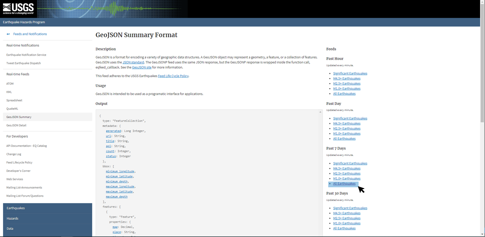
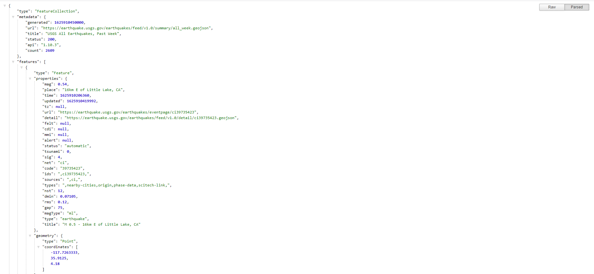
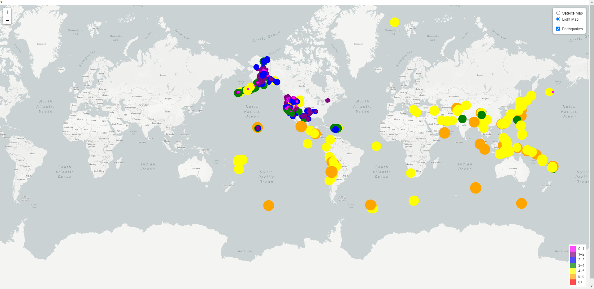
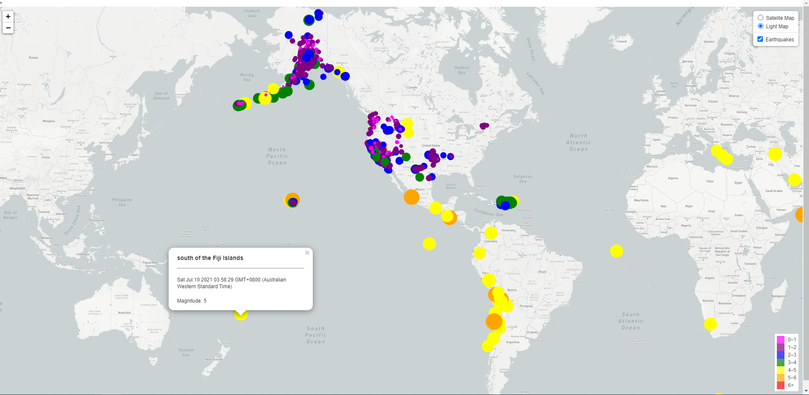
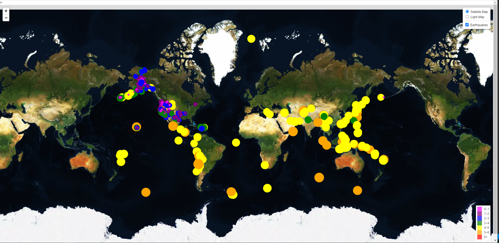
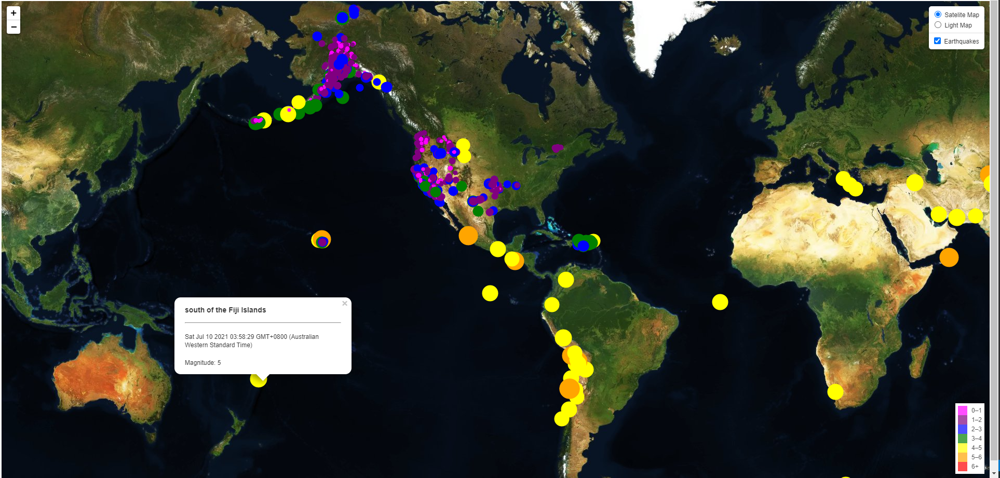

# leaflet-challenge - Earthquake Data Visualization
Week 17 - Homework

## Background


Welcome to the United States Geological Survey, or USGS for short! The USGS is responsible for providing scientific data about natural hazards, the health of our ecosystems and environment; and the impacts of climate and land-use change. Their scientists develop new methods and tools to supply timely, relevant, and useful information about the Earth and its processes. As a new hire, you will be helping them out with an exciting new project!

The USGS is interested in building a new set of tools that will allow them visualize their earthquake data. They collect a massive amount of data from all over the world each day, but they lack a meaningful way of displaying it. Their hope is that being able to visualize their data will allow them to better educate the public and other government organizations (and hopefully secure more funding..) on issues facing our planet.

## Assignment structure
```
leaflet-challenge
|__ .git                                                      # Gitignore file
|__ README.md                                                 # Markdown README
|__ index.html                                                # HTML file
|  |__ static/                                                # JavaScript and CSS Styles directory
|     |__ css/                                                # CSS Styles directory
|        |__ style.css                                        # Style CSS file
|     |__ js/                                                 # JavaScript directory
|        |__ logic.js                                         # JavaScript file
|        |__ config.js                                        # Config file
|  |__ Images/                                                # png screenshots
|     |__ 1-Logo.png                                          # png
|     |__ JSON.PNG                                            # png
|     |__ lightmap.PNG                                        # png
|     |__ popupslight.png                                     # png
|     |__ popupssattelite.png                                 # png
|     |__ satellitemap.PNG                                    # png
|     |__ USGS.PNG                                            # png

```

## Usage

```
HTML
* <!DOCTYPE html>
* <html lang="en">

D3
* <script src="https://d3js.org/d3.v5.min.js"></script>

JavaScript
* <script type="text/javascript" src="static/js/logic.js"></script>

Leaflet
* <script src="https://unpkg.com/leaflet@1.6.0/dist/leaflet.js"
* integrity="sha512-gZwIG9x3wUXg2hdXF6+rVkLF/0Vi9U8D2Ntg4Ga5I5BZpVkVxlJWbSQtXPSiUTtC0TjtGOmxa1AJPuV0CPthew=="
* crossorigin=""></script>

```

## Datasets 

|No|Source|Link|
|-|-|-|
|1|USGS GeoJSON Feed|http://earthquake.usgs.gov/earthquakes/feed/v1.0/geojson.php|
|2|index.html|https://github.com/alysnow/leaflet-challenge/blob/main/index.html|
|3|logic.js|https://github.com/alysnow/leaflet-challenge/blob/main/static/js/logic.js|


## Level 1: Basic Visualization

### Visualize an earthquake data set.

1. **Get the data set**

   

   The USGS provides earthquake data in a number of different formats, updated every 5 minutes. Visit the [USGS GeoJSON Feed](http://earthquake.usgs.gov/earthquakes/feed/v1.0/geojson.php) page and pick a data set to visualize. For this assignment I have selected 'All Earthquakes from the Past 7 Days'. When you click on a data set, for example 'All Earthquakes from the Past 7 Days', a JSON representation of that data will be provided. You will be using the URL of this JSON to pull in the data for our visualization.

   

2. **Import & Visualize the Data**

   Created a map using Leaflet that plots all of the earthquakes from the data set based on their longitude and latitude.

   * The data markers reflect the magnitude of the earthquake in their size and color. Earthquakes with higher magnitudes appear larger and darker in color.

   * Popups have been created to provide additional information about the earthquake when a marker is clicked.

   * A legend has been created that provides context for the map data.


### Earthquake Light Map



### Earthquake Light Map including Popups



### Earthquake Sattelite Map



### Earthquake Sattelite Map Popups




## Launched Page

https://alysnow.github.io/leaflet-challenge/index.html


## Contributor
- [Alysha Snowden](https://github.com/alysnow)